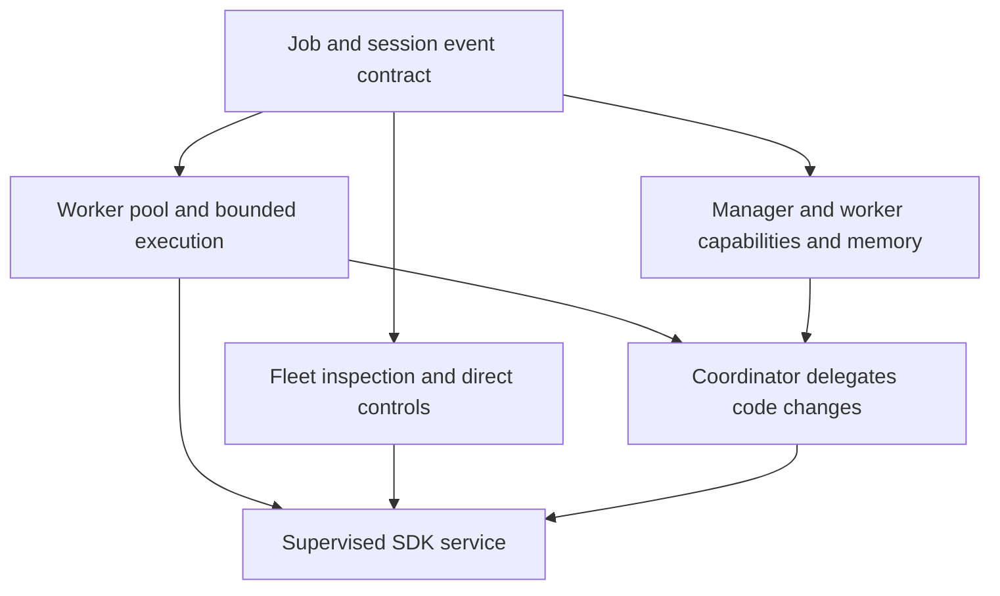

# Metagenda Roadmap

Metagenda automates planning, coordination, and improvement across projects. The
roadmap connects idea refinement and priorities with execution, reviews,
retrospectives, and resource allocation. The Pi harness and shared extensions
support these workflows; Telegram provides a conversational interface.
[SPEC.md](./SPEC.md) defines target behavior; GitHub issues hold acceptance
criteria and implementation work.

### Release targets

Versions mark delivery milestones rather than dates. Work may proceed in
parallel across milestones, but each release must satisfy its dependencies
before shipping.

| Release | Scope                                                                                                                                                        |
| ------- | ------------------------------------------------------------------------------------------------------------------------------------------------------------ |
| v0.1    | Replace workflows with interactive worker pools, durable jobs and attempts, bounded execution, cancellation, and cleanup when the owning session closes.     |
| v0.2    | Add manager and worker modes, delegated code changes, manager-only general memory, fleet dashboard panels and controls, and human-controlled urgency.        |
| v0.3    | Add the supervised Pi SDK service, portable CLI, dashboard, and Telegram exports. Dashboard visibility and control are prerequisites for background hosting. |
| v0.4    | Add idea intake, research, refinement, and issue-to-job planning.                                                                                            |
| v0.5    | Add durable plans, reporting, delivery tracking, and cross-project coordination.                                                                             |
| v0.6    | Add adaptive capacity allocation, measured project consumption, and provider-limit handling.                                                                 |

Basic job budgets belong to v0.1, while editable project allocation controls
belong to v0.2. v0.6 adds adaptive allocation. Shared tooling improvements ship
alongside the release that needs them. Event Sorcery integration has no assigned
release.

## Delegate work through observable jobs

Keep interactive coordination responsive while workers execute bounded jobs.
Replace workflow execution first, preserve visibility throughout the transition,
and adopt background SDK hosting only after fleet inspection and controls work.
The accepted decision is recorded in
[ADR 01](./adrs/01-observable-job-pools.md).

- [ ] Agree the job and session event contract: prompts, invocation metadata,
      allowed tools, budgets, outputs, identity, and lifecycle -
      [#32](https://github.com/dataclique/metagenda/issues/32).
- [ ] Verify durable attempt identity, attempt-owned outputs, ordered events,
      terminal deduplication, shutdown cancellation, claim fencing, and restart
      reconciliation without duplicate execution -
      [#32](https://github.com/dataclique/metagenda/issues/32).
- [ ] Replace workflow execution with an interactive instance's worker pool; the
      coordinating agent decides subsequent jobs -
      [#32](https://github.com/dataclique/metagenda/issues/32).
- [ ] Enforce job budgets, concurrency, cancellation, and recovery -
      [#24](https://github.com/dataclique/metagenda/issues/24),
      [#16](https://github.com/dataclique/metagenda/issues/16).
- [ ] Stop workers and all session-owned background resources when the initial
      interactive session closes; retain job records and outputs -
      [#32](https://github.com/dataclique/metagenda/issues/32).
- [ ] Configure manager and worker launch modes, reject competing manager
      launches, and enable general persistent memory only for the manager -
      [#33](https://github.com/dataclique/metagenda/issues/33),
      [#20](https://github.com/dataclique/metagenda/issues/20).
- [ ] Remove direct code-changing tools from the interactive coordinator once
      worker execution is usable; retain code reading and job controls -
      [#33](https://github.com/dataclique/metagenda/issues/33).
- [ ] Expose fleet sessions, jobs, tool activity, outputs, usage, failures,
      cancellation, and reconnect evidence in the dashboard -
      [#34](https://github.com/dataclique/metagenda/issues/34).
- [ ] Implement the specification's panel catalog, including planning, agent
      tasks and replies, question answering, PR review readiness, and editable
      resource allocations -
      [#34](https://github.com/dataclique/metagenda/issues/34),
      [#24](https://github.com/dataclique/metagenda/issues/24).
- [ ] Route worker urgency proposals to manager judgment and apply authenticated
      human urgency decisions directly, retaining reasons and outcomes -
      [#33](https://github.com/dataclique/metagenda/issues/33).
- [ ] Adopt supervised SDK hosting after dashboard inspection and direct
      controls replace terminal visibility; no intermediate RPC migration is
      required - [#33](https://github.com/dataclique/metagenda/issues/33),
      [#22](https://github.com/dataclique/metagenda/issues/22).

Pool implementation, dashboard rendering, and manager capability configuration
can proceed in parallel after agreement on their shared contract. Keep workers
visible until dashboard inspection and controls are verified. Once the service
owns execution, closing an interactive interface does not stop its jobs. Future
persistence work can integrate
[Event Sorcery](https://github.com/dataclique/event-sorcery), a Rust library for
event sourcing and durable job dispatch, through its planned TypeScript
bindings. That integration would cover job and coordination state transitions;
transcripts retain their separate storage. The initial pool uses existing
persistence contracts.

## Turn ideas into coordinated work

Develop ideas into researched, tracked work, then coordinate implementation and
independent verification. Telegram intake is one entry point; a conversation
fragment alone does not authorize execution.

- [ ] Link planned work to the preceding epic's execution contract while
      retaining issue-to-job ownership -
      [#16](https://github.com/dataclique/metagenda/issues/16).
- [ ] Connect idea intake, research, refinement, and issue creation to durable
      cross-project planning -
      [#15](https://github.com/dataclique/metagenda/issues/15).
- [ ] Keep issues and sub-issues linked to the project roadmap; update roadmap
      PRs when priorities or scope change -
      [#15](https://github.com/dataclique/metagenda/issues/15).
- [ ] Apply Unslop to published prose and independently check that research,
      requirements, and priority changes retain their meaning -
      [#15](https://github.com/dataclique/metagenda/issues/15).
- [ ] Keep unreconciled conversation separate from actionable work -
      [#13](https://github.com/dataclique/metagenda/issues/13).

## Keep plans and agent work aligned

Make weekly commitments, daily priorities, progress, and corrections visible
across projects. Agents work from the current plan, while saved revisions make
planned-versus-actual reporting possible.

- [ ] Preserve plans, revisions, reporting windows, and acknowledged corrections
      across restarts -
      [#15](https://github.com/dataclique/metagenda/issues/15).
- [ ] Produce evidence-backed daily and weekly views, with missing information
      explicit - [#15](https://github.com/dataclique/metagenda/issues/15),
      [#17](https://github.com/dataclique/metagenda/issues/17).
- [ ] Deliver work to the intended capable agent and distinguish receipt from
      completion - [#18](https://github.com/dataclique/metagenda/issues/18).
- [ ] Preserve paused roles and live-agent discovery without resuming paused
      work - [#9](https://github.com/dataclique/metagenda/issues/9),
      [#20](https://github.com/dataclique/metagenda/issues/20).

## Allocate capacity without making Pi unresponsive

Set adjustable engineering-resource allocations by project. Track actual
consumption against those targets and adapt background work to provider limits
while preserving responsive interactive use. Project priorities and provider
throttling are separate controls.

- [ ] Measure delivery latency, backlog age, acceptance, rework, and human
      intervention alongside activity counts; expose coverage and outcome links
      in the dashboard -
      [#17](https://github.com/dataclique/metagenda/issues/17),
      [#34](https://github.com/dataclique/metagenda/issues/34).
- [ ] Compare model tiers by total usage and time through acceptance, including
      failed attempts; route human-facing prose through lightweight Unslop
      jobs - [#24](https://github.com/dataclique/metagenda/issues/24),
      [#33](https://github.com/dataclique/metagenda/issues/33).
- [ ] Support separate usage accounting, reset windows, and admission for
      multiple authorized subscriptions from one provider -
      [#24](https://github.com/dataclique/metagenda/issues/24).

- [ ] Extend allocation planning with measured consumption and visible
      deviations from project targets -
      [#15](https://github.com/dataclique/metagenda/issues/15).
- [ ] Adapt background work to remaining usage, reset windows, queued
      priorities, and interactive demand -
      [#24](https://github.com/dataclique/metagenda/issues/24).
- [ ] Preserve execution permissions, cancellation, bounded concurrency, and
      reserved capacity -
      [#16](https://github.com/dataclique/metagenda/issues/16).

## Run the shared service reliably

Deliver portable Telegram, CLI, and observational dashboard capabilities with
verified service contracts and recovery behavior.

- [ ] Complete package and service export contracts, identity and state
      boundaries, restart recovery, and receiving verification -
      [#22](https://github.com/dataclique/metagenda/issues/22).
- [ ] Finish the portable CLI contract and account for existing consumers -
      [#6](https://github.com/dataclique/metagenda/issues/6).
- [ ] Verify dashboard and Telegram exports before host consumption; retain the
      detailed compatibility gates in the
      [import manifest](./docs/migrations/dotconfig-intake.md) and
      [#22](https://github.com/dataclique/metagenda/issues/22).
- [ ] Prepare host wiring without activation; verify product isolation, then
      perform an explicitly authorized cutover with rollback -
      [#22](https://github.com/dataclique/metagenda/issues/22).

Portable packaging can progress alongside planning. Deployment depends on
verified exports; product refinement does not depend on completing every
migration task. Source provenance belongs in implementation records, not the
product's purpose.

## Improve shared development tools

- [ ] Finish shared tooling correctness and diagnostics -
      [#10](https://github.com/dataclique/metagenda/issues/10),
      [#11](https://github.com/dataclique/metagenda/issues/11),
      [#12](https://github.com/dataclique/metagenda/issues/12).
- [ ] Improve image presentation and TSX highlighting -
      [#14](https://github.com/dataclique/metagenda/issues/14),
      [#19](https://github.com/dataclique/metagenda/issues/19).
