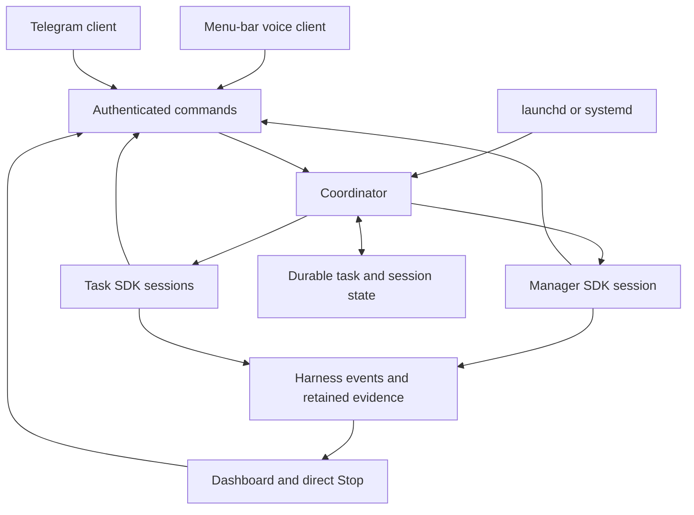
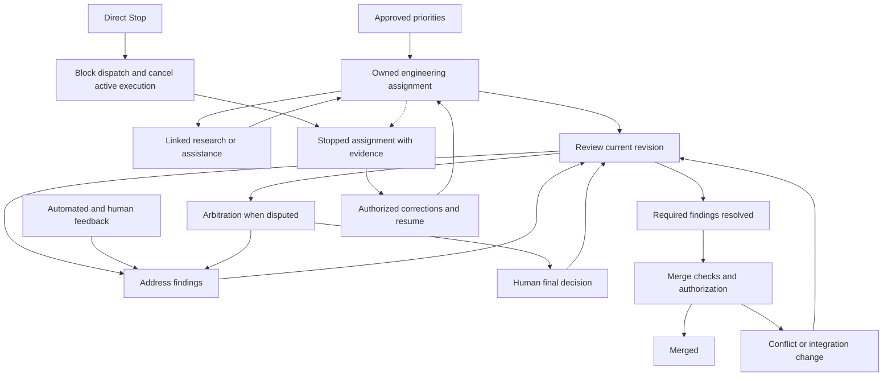

# Metagenda Specification

Metagenda helps a small team deliver more work across projects without a
corresponding increase in coordination overhead. It brings together idea
refinement, priorities, work sessions, progress tracking, reviews,
retrospectives, and resource allocation.

The custom Pi harness, locally owned extensions, and agent pipeline support
research, planning, implementation, independent verification, and progress
reporting. Telegram provides a conversational interface; GitHub holds the
project backlog and reviewable changes.

This document defines the target system. Delivery order, migration steps, and
implementation status belong in the roadmap and delivery records.

## Agent coordination

The harness coordinates agent sessions, available tools, bounded work, review,
and recovery. Shared Pi extensions provide reusable capabilities across
projects. Durable delivery, canonical backlog reconciliation, role ownership,
and usage accounting support the pipeline without creating competing sources of
truth.

Execution remains bound to project scope and authenticated permissions. Routing,
registration, planning, and usage allocations do not grant new authority.
Upstream extensions remain pinned packages; locally owned source and personal
configuration retain their documented ownership boundaries.

A role describes responsibilities and capabilities; it does not require a
permanent process or conversation. A work item retains its identity, owner,
acceptance criteria, artifacts, and history across bounded runs. Engineering
capacity is shared across projects. A new project assignment starts with fresh
context; resuming an existing assignment restores its own context.

Workers can request research or implementation assistance as linked tasks in the
same scheduling and observability system. Dependencies and assignments may
change as findings arrive. Scripted workflows remain useful for known sequences;
dynamic coordination does not remove review or authorization gates. Neither
mechanism requires a separate, hidden hierarchy of workers.

The manager provides one conversational entry point and coordinates work
requiring judgment. Runtime code owns scheduling, delivery, execution limits,
cancellation, and durable state. Workers can exchange scoped messages without
routing every exchange through a manager model turn. Messages distinguish
requests, evidence, proposed changes, and accepted assignments.

The target runtime embeds Pi through its SDK in supervised worker processes. The
coordinator runs independently of the manager conversation and owns process
lifecycles. Clients interact with sessions through authenticated commands and
observe their events; no native Pi terminal must stay open. The manager is a
resumable session, not the process that keeps the rest of the system alive.

The manager and task workers use the same SDK session host. They differ in
tools, permissions, retained history, and memory policy. A persistent manager
conversation does not require a separate RPC implementation. Shared session
hosting keeps event delivery, steering, cancellation, and recovery consistent;
it does not require sessions to share a process or conversation context.

The packaged TypeScript service runs under launchd on macOS or systemd on Linux.
The service manager supervises the coordinator, which supervises Pi workers.
Service restart preserves durable task state and does not resume explicitly
stopped work. The [runtime ADR](./adrs/01-sdk-session-runtime.md) records the
architecture and alternatives.

Commands and events cross authenticated runtime boundaries. Session boxes
represent separate contexts, not necessarily one process per box.

## Planning and execution

An idea can begin as a short message. Agents research its context, identify
missing information, and refine it into clear issues and sub-issues. Published
descriptions pass Unslop and retain the technical substance without private
conversation. Roadmap changes are proposed through a new or relevant existing PR
and checked independently before human review.

Weekly plans and daily priorities retain their original commitments and later
revisions. Reports distinguish planned, completed, carried-over, blocked, and
newly prioritized work, with evidence and missing coverage explicit. Priority
corrections reach affected agents; a completed task does not erase what was
originally planned.

Research, issue creation, assignment, execution, and publication have distinct
permissions. A conversation fragment is not an instruction to execute. Team
members act through authenticated identities and configured permissions.

One product-owner function maintains priorities across projects. Weekly
direction requires human approval before work is allocated to human or agent
capacity. Engineering assignments can include parallel research without making
research a mandatory stage for every task.

### Delivery and review

Publish a draft PR early and mark it ready at the first submission to the
internal review agent. Internal findings, configured automated reviews such as
CodeRabbit, and subsequent human feedback feed the same correction loop. Agent
acceptance does not impersonate a human GitHub review verdict.

The engineering assignment remains owned until review accepts the changes and
required findings are addressed. Waiting for review may release compute capacity
without discarding ownership, conversation, or artifacts. Revised code must be
checked against the current revision; earlier acceptance cannot approve unseen
changes.

An optional arbitration agent attempts to resolve review disputes. A human can
arbitrate directly and makes the final decision on unresolved disputes. A
release-management function may merge only under the project's explicit merge
permissions and satisfied checks and approvals. Merge conflicts and integration
changes return to verification before release.

These are dependencies and completion gates. Assistance and arbitration are
conditional; they are not mandatory stages in a fixed workflow.

### Operations and urgent work

Operator tasks observe service health and report evidence. A proposed hotfix is
validated independently with fresh context before it takes priority over planned
work. If capacity is full, preemption saves the interrupted assignment and its
artifacts, starts the urgent assignment with separate context, and permits later
resumption without mixing project state.

Optional operator capabilities include emergency shutdown or other mitigation
while humans are unavailable. Each requires explicit authorization, bounded
actions, and domain-specific risk controls. Observed log text cannot grant those
permissions. Capability availability does not grant standing authorization to
operate production systems.

## Resource allocation

Project allocations are adjustable targets for engineering effort. Measured
consumption and deviations are visible across projects; no project has a fixed
percentage prescribed by the product.

Dynamic throttling adapts background work to remaining provider usage, reset
windows, queued priorities, and interactive demand. Interactive planning and
steering remain responsive. Allocation targets do not guarantee capacity, and
unavailable usage data or exhausted limits remain explicit. Throttling preserves
pause, cancellation, execution permissions, and concurrency limits.

## Product boundaries

The system has one authoritative state across its tools. A proposed, assigned,
running, blocked, reviewed, or completed item is distinguished explicitly;
acknowledgement is not completion. A display name or model is not an identity or
authority.

The hierarchy is:

[SPEC.md](./SPEC.md) and [ROADMAP.md](./ROADMAP.md) -> GitHub issues -> bounded
execution tasks -> verified changes

The CLI supports Markdown parsing, task selection, work sessions, recording,
playback, and trace export. Telegram uses Piece of Pi; the observational
dashboard uses SolidJS and Dockview.

The system supports a single-machine deployment. Durable agent, work, and
message identities must not depend on process IDs, terminal panes, or local
filesystem paths. Host-local workspace locations remain explicit mappings.
Versioned messages and scoped authority preserve compatibility with remote
workers and other coordinators without requiring distributed deployment.

## Conversation and memory

Telegram, voice, and optional terminal or dashboard clients address the same
manager conversation. Switching clients does not create a second manager or lose
pending questions. Clients identify the conversation and preserve ordering and
deduplication when messages arrive concurrently.

A personal macOS menu-bar client can provide voice access from any application,
with a compact default view and an expandable live transcript. It should allow
inspection of transcription and explicit corrections to submitted instructions.
Personal voice clients remain separate from the shared package. A terminal may
remain available for direct work and debugging without being required for
routine supervision.

The manager retains conversation history and durable decisions across compaction
and restart. Retrieved memory records its source and revisions; a summary cannot
replace the original authorization evidence. Task runs receive relevant project
context and retain their transcripts and artifacts for review or resumption.
They do not require a general personal memory shared across unrelated tasks. The
memory and client packages must satisfy these contracts.

## CLI contract

Parsing, planning, configuration, commands, recording, and lifetimes remain
separate. Fixtures are isolated and do not use a personal vault or live
services. Public command compatibility is maintained through versioned
contracts.

The portable `fj` contract includes the distinct Nix exports
`packages.<system>.fj` and `apps.<system>.fj`, plus `bin/fj` and
`share/nushell/fj/mod.nu`. The default app provides the Metagenda CLI. `fj`
provides default repository status, `help`, `issue list/view`, and
`pr list/view`, preserving gh argument and caller-working-directory semantics.
Completion suggests one argument at a time: `help`, `issue`, or `pr`, then
`list` or `view` for tracker commands.

Repository inspection commands grant no host, session, service, or state
authority. Routing helpers do not gain execution authority.

Default status uses But only for verified main-worktree topology and
source-branch heuristics. Linked or unmanaged worktrees use Git. Topology
failures and selected But failures cannot fall back to a successful result.

## Protocol and durable state

The Pi bridge and SQLite state use versioned contracts for identity, delivery
capability, claim lifecycle, question binding, and restart recovery. Pure
decoding is separate from transport and store effects.

Persisted and external values are validated. Unknown versions, malformed
identities, and invalid transitions cannot gain permissions through fallback
behavior. State formats define compatibility and recovery rules. Private state
is excluded from distributable packages and public artifacts.

## Dashboard contract

The dashboard observes health, agents, jobs, backlog, and usage through a typed
server boundary. Malformed or unavailable data is represented explicitly. Layout
is not authoritative state.

Live execution events must come from the harness. Each run exposes its work
item, dependencies, current state, active tool, available output, usage, and
retries. Inspection leads to actual tool results, diffs, checks, review
findings, and retained transcripts rather than only an agent's summary. Access
to private content is scoped and redacted where required; transcripts are not
public logs. Missing usage, stale streams, disconnected workers, and incomplete
output remain visible. Reconnection reconciles retained events with current
execution state.

Direct Stop controls bypass model reasoning and manager message delivery. The
runtime blocks new dispatch and automatic retries for the stopped work, requests
cancellation of active execution and its owned child runs, and records effects
that completed before cancellation. It distinguishes stopping, stopped, failed
cancellation, and unknown execution state. Stop does not promise rollback of
external effects or terminate unrelated work. A global work stop leaves the
manager available to discuss corrections.

Stopped work does not automatically restart through a dependency, retry, or
replacement run. After corrections, an explicit authorized resume or replacement
retains the task's evidence and records the changed instructions. Human controls
remain available even when the manager model is unavailable.

Dashboard controls use separate authenticated commands with authorization,
failure behavior, and tests.

## Telegram contract

Telegram uses authenticated identity, session routing, question correlation,
durable delivery, and explicit configuration and state paths. Stale choices
cannot retarget a request. Duplicate delivery, retry, restart, expiry, and
cancellation each have explicit behavior.

Shared messages never mirror private owner or agent traffic. The protocol
remains versioned and validates identity, capability, delivery, and lifecycle
state at every boundary.

## Packaging and reproducibility

Nix provides reproducible packages; Bun manages workspace dependencies. The
pinned `dataclique/but.nix` package supplies GitButler in the main worktree;
linked worktrees use plain Git. Manifests and lockfiles record exact versions.

Portable packages are independent of a home directory, launcher, and private
configuration. Machine activation is separate. Skills and scripts may use shared
code, while deterministic validation and delivery remain in tested code. Source
provenance, licenses, and tracker history are preserved.

## Shared hosting

The target is one shared instance for Metagenda, Moneymentum, and Yielduck.
[dataclique/infra](https://github.com/dataclique/infra) owns its provisioning
and activation. Metagenda owns portable packages and its service, state, and
identity contracts.

Service activation and changes to live state or routing require operator
authorization. Services expose their revision, health, and recovery state.

Product isolation must hold for privileges, state paths, credentials, and
routing between Metagenda and the other products. A shared host does not imply
employee control, tenant boundaries, or cross-machine claims. Those require an
explicit design.

## Safety and lifecycle

Delegated owner instructions retain cryptographically verifiable origin,
content, and scope. An agent's interpretation or paraphrase is separate evidence
and cannot acquire owner authority by being forwarded. Verification must reject
tampering, replay outside the permitted scope, and expired or revoked authority.

Every tool call passes the authorization classifier. Independent audits may
challenge task interpretation, scope, or claimed completion using the original
instruction and execution evidence. Worker-auditor disagreements go to the
manager for an evidence-based resolution; that resolution cannot bypass policy
or expand authority. Unresolved disputes have bounded escalation rather than
indefinite retries. An uncontested need for clarification goes directly to the
human through Telegram; it does not require manager arbitration first.

Authority, privacy, stable durable identity, and terminal, retry, expiry, and
cancellation states are explicit. Typed boundaries fail safely without panics,
coercion, or invented results.

Listener, process, worker, temporary-file, and claim lifetimes are bounded.
Recovery is verified before retirement. Observations never become policy or
state authority.
